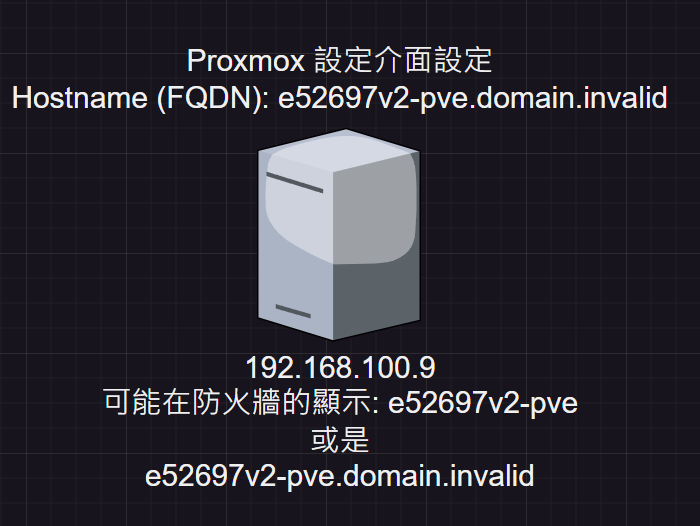

# 圖形化安裝過程

## ELUA　同意
> 這不同意怎繼續下去呢? ~~還不同意~~ (有興趣可以看一下)

## 選擇硬碟
> 規劃硬碟的每個大小等  
> swap 與 使用硬碟大小等  
> 此設定僅設定所選取的硬碟作為系統碟(通常建議 系統碟不需要太大 盡量讓 系統碟指放PVE 與 ISO 檔就好，不要放虛擬機在上面)  
> 建議硬碟硬體設備採用 SSD  

## 國家、時區、鍵盤輸入
> 這個在啟動時，有連線網路，會自動判斷外網的IP來選擇國家。  
> 時區  
> 鍵盤輸出(此建議預設英文，除非你有特殊使用習慣)  
## 設定 root 使用者
> Proxmox ve 的 root 預設領域設定為 PAM 領域

> 使用者領域差異  
> PAM => Linux PAM standard authentication  
> pve => Proxmox VE authentication server  

1. root 密碼
2. root 的email
> 此處的 email 為收信的 email 如果你不想要收到信件就預設即可  
> Tips:  
> - 如果你有購買網域在 namecheap 上  
> 那你可以免費使用網域的email服務 ， 你在把 像是 pve_E52697v2@you_buy.domain 打上並且在 namecheap 上有做對應設定與轉址到哪一個信件上，那這樣就大功告成了，未來有重大事件都會寄信給你知道。 [如何確定你的pve會寄信給你?](#)

## 設定 網路與主機名稱
- 設定網卡相關IP設定，如果你想保留預設DHCP給指派的IP那就可以直接下一步
- Hostname(FQDN): 這個是我對設定 Hostname(FQDN)的見解: 有誤可以糾正。
> - 最貼切的說法就是： 如果有使用 ASUS 路由器的時候你可以發現，明明沒有給Windows電腦的名稱但是路由器可以讀取到你的裝置名稱幫你添加上去，那個就是可以說是 FQDN 的東西，讓你可能在防火牆伺服器上面可以有個比較淺顯易懂的文字來讓你快速知道說這台主機哪一台是在幹嘛的。  
> 有就會變成下面的圖示

- IP 設定你指定的固定IP位置或是預設好的IP做使用
  - / ``24`` 為網路遮罩(Subnet Mask)。 此 ``24`` 為預設的: ``255.255.255.0``
- gateway 通常設定的路由器的IP位置
- DNS Server: 建議如果你的伺服器架設在台灣並且用預設Debain的套件伺服器，不變更套件伺服器的話需要設定成 Google DNS: 8.8.8.8 才可以抓取 Debain 預設指定的套件伺服器。

# 完成
> 設定好後，會給你一個最終確定頁面，都沒有問題後就可以按下下一步開始安裝，並且休息一下，準備進入到下一個章節。

[None](#) | · | [Next](./1-設定網頁控制台.md)