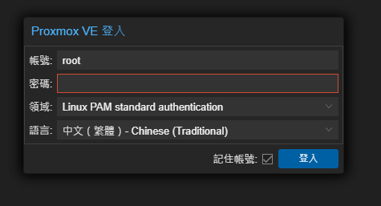

# 進入控制台
> 重開機後你會看到一個黑白終端機畫面上面會有一串網址
> - 需要在伺服器的相同網域下，在自己的電腦瀏覽器上訪問此 網址
> - 網址舉例: https://192.168.100.9:8006/
> 瀏覽器登入時候出現不安全警訊我們可以先關閉

> 1. 可以先把你的登入介面改成像上面一樣
> 2. 輸入剛剛在設定時的密碼
> 這樣基礎的設定就完成了..下面的動作你就可以可選的操作，如果為必要的就需要慎重的檢視是否需要使用

# 讓可信任主機從無簽證的 https 變成有簽證的 https 
> 如果都安定下來，不會修改 IP 與換網域的話可以製作一個 自己的電腦與網頁控制台的簽證來避免再登入控制台的時候表示不安全  
> 雖然說，這個沒啥用意，畢竟你的控制台這之間都是在內網上操作，但為了讓瀏覽器不要出現不安全警訊，我們就來製作一個簽證並且提升你與控制台之間的的封包安全性。

## 下載 mkcert 自簽證軟體
[下載載點](https://github.com/FiloSottile/mkcert/releases)
[Windows x86 - x64](https://github.com/FiloSottile/mkcert/releases/download/v1.4.4/mkcert-v1.4.4-windows-amd64.exe)
- 下載完後，把mkcert-v{版.本.號}-windows.amd64.exe 修改成 mkcert.exe (如果沒有看到 .exe 字樣就不需要添加.exe)
- 在持有mkcert.exe的目錄下執行``cmd``以下其中一個指令
- > 注意: 下面的所有 IP 需要對應你自己的控制台IP 除非你的控制台 IP 跟我教學的網段與IP 相同 要不然需要確認你給的 IP 是否正確!
```
mkcert.exe -install 192.168.100.9
或是
mkcert -install 192.168.100.9
```
- 完成後你會看到兩個檔案
```
192.168.100.9.pem
192.168.100.9-key.pem
```
- 在自己的節點>系統>憑證
- 上傳自有憑證
- 私鑰部份上傳: 192.168.100.9-key.pem
- 憑證串鏈部份上傳: 192.168.100.9.pem
- 按下上傳後，等待控制台頁面有刷新的閃爍後，把所有 pve 的控制台頁面關閉後，再從新分頁打開，就會看到鎖頭囉!

## 變更 "套件庫" 從企業更新通道 改成 免費更新通道
> 如果你有購買企業序號，輸入序號後就不需要在把套件庫的通道改成免費的，直接[挑轉至](#更新系統套件)
- 在自己的節點>更新>套件庫
- 點擊 ``File: /etc/apt/sources.list.d/pve-enterprise.list (1 repository)`` 內的 元件 pve-enterprise 
- 點擊停用
- 再來點擊 ``新增`` 按鈕，選擇 ``No-Subscription(無訂閱選項)``

> 在 pve 8.0 上新增了 Ceph Quincy 預設也是企業版本
> - 重複上面的 點擊動作在 ``File: /etc/apt/sources.list.d/ceph.list (1 repositories)``
> - 點擊停用
> - 再來點擊 ``新增`` 按鈕，選擇 ``Ceph Quincy No-Subscription(無訂閱選項)``

### 更新系統套件
- 新增完後就可以點擊``套件庫`` 上層 ``更新``
- 點擊``重新整理``，看有沒有套件可以更新，如果有再按下升級按鈕開啟novnc，等待更新完成。


